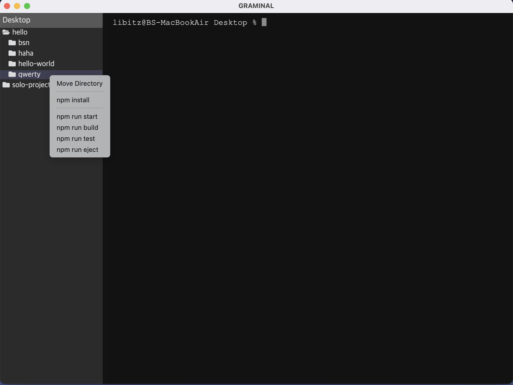

# Graminal

<p align="center">
  
</p>

## 목차
- [프로젝트 소개](#프로젝트-소개)
- [프로젝트 기획](#프로젝트-기획)
- [기술 스택](#기술-스택)
- [개발 기간](#개발-기간)
- [기능 소개](#기능-소개)
- [설치 및 실행](#설치-및-실행)
- [챌린지](#챌린지)
- [회고](#회고)

## 프로젝트 소개

Graminal은 기존의 텍스트 입출력 환경만 있는 CLI(Command Line Interface) 터미널에 GUI(Graphical User Interface) 요소를 더한 터미널 프로그램입니다. 사용자는 Graminal로 터미널 인터페이스를 이용함과 동시에 SideBar, 마우스 우클릭 등의 GUI 요소를 통해 더욱 편하게 터미널을 사용할 수 있습니다.

## 프로젝트 기획

코딩을 처음 배울 때, 텍스트로만 작업할 수 있는 터미널은 저에게 있어 어렵게 느껴지는 도구였습니다. 컴퓨터를 처음 사용할 때부터 마우스를 사용하고, 버튼 클릭과 같은 마우스 인터렉션으로 조작하는 게 익숙했던 제게 키보드 명령어로만 동작하는 터미널은 조금 멀게 느껴졌습니다. 터미널을 사용할 때마다 ‘터미널에 GUI 요소가 있으면 좋을 텐데’라고 생각했던 것을 떠올리게 되어 이번 프로젝트를 기획하게 되었습니다.

## 기술 스택

- React
- Electron
- node-pty
- styled-components
- ansi-to-html

## 개발 기간

전체 일정: 2022.11.07 ~ 2022.11.27 (약 3주)

- 1주차
  - 아이디어 수집 및 검증
  - 기술 스택 결정
- 2주차
  - 터미널 인터페이스 구현
  - Shell 반환값 parsing
  - 사이드바 구현 시작
- 3주차
  - 사이드바 폴더 구조 생성
  - 마우스 우클릭 이벤트 구현
  - 오류 개선

## 기능 소개

<details>
  <summary>기존의 CLI 터미널 인터페이스와 유사한 사용자 경험을 얻을 수 있습니다.</summary>
  
https://user-images.githubusercontent.com/81922977/208599890-e263342e-c92e-4b5e-abe5-e71ea7680f62.mov

</details>

<details>
  <summary>상단바의 메뉴, 또는 단축키 Command + T를 눌러 사이드바를 열 수 있습니다. <br/>&emsp;사이드바에서는 현재 Directory 경로에 대한 Tree View를 볼 수 있으며, context menu를 통해 해당 폴더로 이동할 수 있습니다.</summary>
  
https://user-images.githubusercontent.com/81922977/208601365-9552bfa3-f5d0-47c9-8cc9-accc55a4713b.mov

</details>

<details>
  <summary>폴더가 프로젝트 폴더일 경우, context menu에서 npm install과 scripts에 등록된 npm 명령어를 사용할 수 있습니다.</summary>
  

https://user-images.githubusercontent.com/81922977/208601920-5192a554-62ef-45e1-8d04-1f6a68964620.mp4


</details>

## 설치 및 실행

[Release Page](https://github.com/MochaPresso/graminal/releases)에서 dmg 파일을 다운로드 받아 응용프로그램으로 설치한 뒤 실행합니다.</br>
(현재 프로젝트 배포 진행 중에 있어 다운로드하여도 아직 프로젝트 실행은 불가합니다. 향후 업데이트 예정입니다.)

## 챌린지

### ANSI Escape Code Parsing

터미널 인터페이스와 연결한 shell 출력값에 포함되어있는 ANSI Escape Code를 처리하는 것에 어려움을 겪었습니다. 터미널에서 출력해야할 text와 escape code가 섞여서 출력되었기 때문에, 출력값에 어떤 escape code가 들어있는지 확인하고, 각 escape code에 해당하는 기능을 출력값에 부여한 뒤 해당 code를 제거하고 출력하는 과정을 거쳤습니다. 하지만 text의 색상, 굵기 등과 같은 escape code까지 parsing하기에는 시간이 부족하여 해당 기능을 제공하는 ansi-to-html 라이브러리를 이용해 문제를 해결하였습니다.
```jsx
if (data.includes("\x1B[?25l(\x1B[107;97m") && data.includes("\x1B[?25h") {
  progressBarRef.current = true;

  const splitData = data.split("\x1B[?25l");

  setLines((prevArray) => prevArray.slice(0, -1));
  setLines((prevArray) => [
    ...prevArray,
    convert.toHtml(splitData[0]).trim(),
    convert.toHtml(splitData[1]).trim(),
  ]);

  return;
}
```

### Output Data Buffing

Shell 출력값을 받아오는 과정에서 출력값이 균일하게 반환되지 않는 이슈가 있었습니다. Parsing을 하기 위해서는 하나의 입력값에 대해 언제나 동일한 출력값을 받아야 했는데, 같은 입력값을 전달해도 shell에서 반환하는 데이터가 때에 따라 조금씩 잘려서 들어오는 등의 문제로 제대로 된 parsing을 하기 어려웠습니다. 또한 출력값의 사이즈가 클 경우에도 shell에서 한번에 다 보내지 못하고 일정 단위만큼 잘라서 반환하는 이슈도 있었습니다. 이러한 이슈를 해결하기 위해 buffer method를 참고하여 shell의 입력값을 stack 형태의 자료구조에 저장하면서, 일정 시간이 지나거나 저장된 데이터가 지정한 max size보다 커지는 경우 한번에 보낼 수 있도록 개선하였습니다.
```jsx
const buffer = (timeout, maxSize) => {
  let chunk = "";
  let sender = null;

  return (data) => {
    chunk += data;

    if (chunk.length > maxSize && userInput) {
      userInput = false;
      mainWindow.webContents.send("terminal.incomingData", chunk);
      chunk = "";

      if (sender) {
        clearTimeout(sender);
        sender = null;
      }
    } else if (!sender) {
      sender = setTimeout(() => {
        mainWindow.webContents.send("terminal.incomingData", chunk);
        chunk = "";
        sender = null;
      }, timeout);
    }
  }
};
```

### File Tree View

사이드바에 현재 터미널의 디렉터리에 대한 Tree View를 만들고자 했습니다. Global로 저장되어있는 디렉터리의 경로를 이용해 디렉터리 내용을 읽어오고, 읽어온 디렉터리를 클릭했을 때 해당 디렉터리의 하위 디렉터리와 파일을 읽어와서 화면에 출력해야 했습니다. 현재 디렉터리의 내용을 불러와서 출력하는 과정은 크게 어려움이 없었지만, 디렉터리의 하위 디렉터리와 폴더를 재귀적으로 나타내는 방법을 찾지 못해 어려움을 겪었습니다.

이슈를 해결하기 위해 tree view를 출력하는 컴포넌트 자체를 재귀로 동작하도록 만들었습니다. 디렉터리를 클릭했을 때 해당 디렉터리를 눌렀는지 여부를 state로 저장한 뒤, true인 디렉터리들에 대해서 tree view 컴포넌트를 출력하도록 만들었습니다. 더불어 컴포넌트에 depth를 매개변수로 전달해서 depth 값에 따라 padding-left 값을 더해 하위 디렉터리로 내려가도 해당 디렉터리의 상위 디렉터리를 구분할 수 있도록 만들었습니다.
```jsx
const FileTree = ({ directory, depth }) => {
  const [showNested, setShowNested] = useState({});

  const toggleNested = (directory) => {
    setShowNested({ ...showNested, [directory]: !showNested[directory] });
  };

  return (
    {showNested[entry.name] && (
      <FileTree
        directory={`${directory}/${entry.name}`}
        depth={depth + 1}
      />
    )}
  );
};
```

## 회고

### 프로젝트를 통해 느낀 점

아이디어 결정부터 프로젝트 일정을 기획하고 구체화시키는 작업을 혼자서 진행하면서, ‘기간 내에 완수할 수 있을까’라는 걱정을 가졌었습니다. 여러 번의 과제와 팀 프로젝트를 진행하면서 얻은 경험이 있었지만, 개인 프로젝트는 누군가와 의논하지 않고 스스로 결정해야 했기에 막히는 일에 대해서 더욱 어렵게 느꼈던 것 같습니다.

하지만 프로젝트 처음에 칸반을 통해 계획했던 업무들을 하나 둘 해결하고, 프로젝트가 어느 정도 모양새를 갖추면서 코드로 무언가를 만들 수 있다는, 할 수 있다는 자신감을 얻을 수 있었습니다. 아이디어를 직접 구현할 수 있다는 즐거움이 어려움을 겪을 때 얻는 스트레스보다 더 크게 다가왔습니다. 앞으로의 개발에서도 이번 프로젝트에서 느꼈던 즐거움을 잃지 않으며 개발자로서 성장하고 싶습니다.

### 힘들었던 점

계획했던 기능을 구현하는 과정도 어려웠지만, 돌이켜봤을 때 가장 힘들었던 부분은 아이디어를 선정하고, 선정한 아이디어가 제작이 가능한지를 구체화하고 검증하는 과정이었습니다. 고민해서 선택했던 아이디어가 검증 과정에서 기간 내에 구현하기 어렵다고 판단되거나, 임팩트가 떨어지는 경우 제외하면서 새로운 아이디어를 떠올리는 것이 많이 힘들었습니다. 

최종으로 결정했던 아이디어인 터미널 또한, 프로젝트 검증 과정에서 참고했던 터미널 프로젝트들은 터미널 인터페이스를 구현하기 위해 [Xterm.js](https://github.com/xtermjs/xterm.js)이라는 라이브러리를 사용하고 있었습니다. 저도 처음에는 다른 터미널 프로젝트와 같이 해당 라이브러리를 사용하여 구현하되, GUI 요소에 더 집중하는 것이 좋을지 고민했었습니다. 하지만 터미널 인터페이스를 직접 만들어보면서 터미널의 동작 과정을 공부하고, React와 Node를 이용하여 직접 만드는 것이 프로젝트의 중요한 부분이라고 생각하여 도전하게 되었습니다.

### 개선할 점

프로젝트를 개선한다면, GUI 요소를 좀 더 추가하고 싶습니다. 터미널을 구현하는 과정에서 초기 계획보다 시간을 많이 쏟게 되어 GUI 요소를 더 추가하지 못한 것이 아쉬웠습니다. GUI 요소를 추가하게 된다면,

- 디렉터리에 마우스를 올려놓으면 디렉터리의 용량, 들어있는 파일 개수 등을 출력하는 UI
- 마우스 드래그 앤 드롭으로 파일을 터미널로 끌어오면 바로 실행시킬 수 있는 기능

등을 추가하여 사용성을 높이고 싶습니다.
