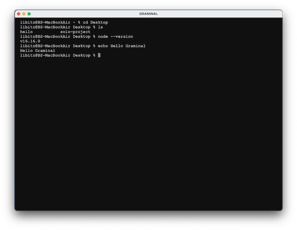
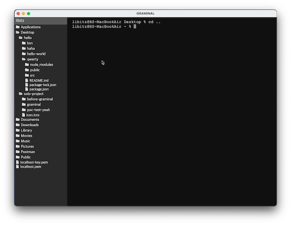
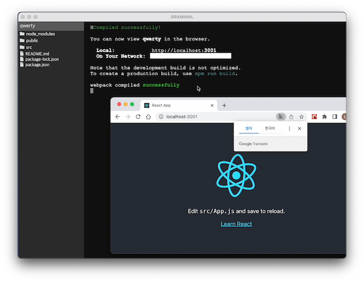

# Graminal

## 프로젝트 소개

Graminal은 기존의 텍스트 입출력 환경만 있는 CLI(Command Line Interface) 터미널에 GUI(Graphical User Interface) 요소를 더한 터미널 프로그램입니다. 사용자는 Graminal로 터미널 인터페이스를 이용함과 동시에 SideBar, 마우스 우클릭 등의 GUI 요소를 통해 더욱 편하게 터미널을 사용할 수 있습니다.

## 프로젝트 기획

저에게 있어 터미널은 사용하기 위해 마주할 때마다 항상 어렵게 느껴지는 도구였습니다. 컴퓨터를 처음 사용할 때부터 마우스를 사용했었고, 마우스로 조작하는 게 익숙했던 제게 키보드 명령어로만 동작하는 터미널은 조금 멀게 느껴졌습니다. 터미널을 사용할 때마다 ‘터미널에 그래픽 요소가 있으면 좋을 텐데’라는 생각을 자주 했었고, 그 생각을 계기로 이번 프로젝트를 기획하게 되었습니다.

## 기술 스택

- React
- Electron
- node-pty
- styled-components
- ansi-to-html

## 개발 기간

전체 일정: 2022.11.07 ~ 2022.11.27 (약 3주)

- 1주차
  - 아이디어 수집 및 검증
  - 기술 스택 결정
- 2주차
  - 터미널 인터페이스 구현
  - Shell 반환값 parsing
  - 사이드바 구현 시작
- 3주차
  - 사이드바 폴더 구조 생성
  - 마우스 우클릭 이벤트 구현
  - 오류 개선

## 기능 소개

기존의 CLI 터미널 인터페이스와 유사한 사용자 경험을 얻을 수 있습니다.

상단바의 메뉴, 또는 단축키 Command + T를 눌러 사이드바를 열 수 있습니다. 사이드바에서는 현재 Directory 경로에 대한 Tree View를 볼 수 있으며, context menu를 통해 해당 폴더로 이동할 수 있습니다.

폴더가 프로젝트 폴더일 경우, context menu에서 npm install과 scripts에 등록된 명령어를 사용할 수 있습니다.

## 어려웠던 점

### ANSI Escape Code Parsing

이번 프로젝트에서 가장 많은 시간을 할애한 부분은 shell 출력값에 포함되어 있는 [ANSI Escape Code](https://en.wikipedia.org/wiki/ANSI_escape_code)를 처리하는 과정이었습니다. 터미널에서 출력해야 할 text와 escape code가 섞여서 출력되었기 때문에, 출력값에 어떤 escape code가 들어있는지 확인하고, 각 escape code에 해당하는 기능을 출력값에 부여한 뒤 해당 code를 제거하고 출력하는 과정을 거쳤습니다. 하지만 text의 색상, 굵기 등과 같은 escape code까지 parsing 하기에는 시간이 부족하여 해당 기능을 제공하는 ansi-to-html 라이브러리를 이용해 문제를 해결하였습니다.

### Output Data Buffing

shell 출력값을 받아오는 과정에서 출력값이 균일하게 반환되지 않는 문제가 있었습니다. parsing을 하기 위해서는 하나의 입력값에 대해 언제나 동일한 출력값을 받아야 했는데, 같은 입력값을 전달해도 shell에서 반환하는 데이터가 때에 따라 조금씩 잘려서 들어오는 등의 문제로 제대로 된 parsing을 하기 어려웠습니다. 또한 출력값의 사이즈가 클 경우에도 shell에서 한 번에 다 보내지 못하고 일정 단위만큼 잘라서 반환하는 문제도 있었습니다. 이러한 문제를 해결하기 위해 buffer method를 참고하여 shell의 입력값을 임시 공간에 계속 모아두다가, 일정 시간이 지나거나 저장된 데이터가 지정한 max size보다 커지는 경우 한 번에 보낼 수 있도록 개선하였습니다.

### File Tree View

사이드바에 현재 터미널의 Directory에 대한 Tree View를 만들고자 했습니다. Global로 저장되어 있는 Directory의 경로를 이용해 Directory 안에 있는 폴더와 파일을 읽어오고, 읽어온 폴더를 클릭했을 때 다시 해당 폴더에 대한 하위 폴더와 파일을 읽어와서 화면에 출력해야 했습니다. 현재 Directory의 폴더와 파일을 불러와서 출력하는 과정은 크게 어려움이 없었지만, 폴더를 눌렀을 때 해당 폴더의 하위 폴더들을 나타내는 방법을 찾지 못해 어려움을 겪었습니다.

문제를 해결하기 위해 tree view를 출력하는 컴포넌트 자체를 재귀로 동작하도록 만들었습니다. 폴더를 클릭했을 때 해당 폴더가 클릭된 상태 여부를 state로 저장한 뒤, true인 폴더들에 대해서 tree view 컴포넌트를 출력하도록 만들었습니다. 더불어 컴포넌트에 depth를 매개변수로 전달해서 depth 값에 따라 padding-left 값을 더해 하위 폴더로 내려가도 해당 폴더의 상위 폴더를 알 수 있도록 만들었습니다.
